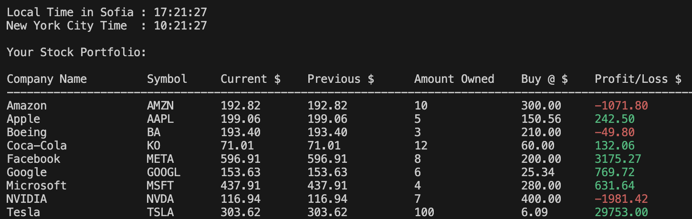

# Real-Time Stock Monitor 📊

A Java-based console application that tracks real-time stock prices using the [Finnhub API](https://finnhub.io/). It helps you monitor your portfolio, showing current prices, profit/loss, and time zone information.

## 🔧 Features

- Fetches **live stock quotes** using the Finnhub API
- Tracks multiple stocks with customizable quantity and purchase price
- Displays profit/loss in real-time with color-coded output
- Auto-refreshes every 15 seconds using a scheduled task
- Shows current time in both **Sofia (Europe)** and **New York (US)** time zones

---

**Compile the code : **
   javac -cp lib/gson-2.10.1.jar -d out src/*.java

**Run the code : **
   java -cp "out:lib/gson-2.10.1.jar" src.StockTracker